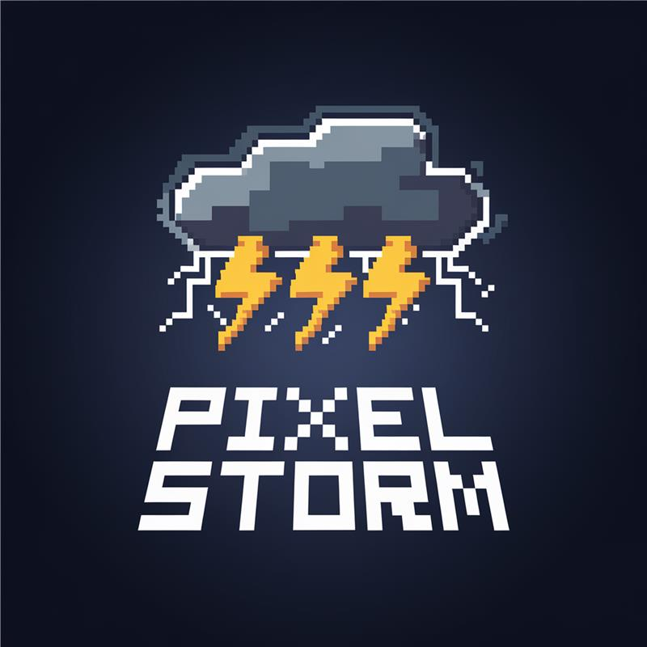
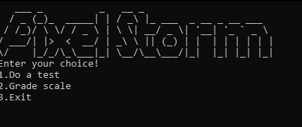
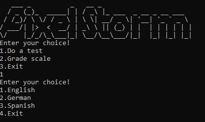

# Sprint-9th-grade-Math-Games
<h1 align="center">Pixel Storm</h1>

  

<h2>📰About</h2>
<h3 align="center">
  Our idea is to create an innovative and interactive application that makes language learning more engaging and accessible for students. Through fun tests, interactive exercises, and personalized challenges, users will be able to reinforce and develop their knowledge of different languages.
</h3>

<h2>📷Screenshots</h2>

      
  

<h2>📥Installation</h2>
<h3>1. Open a terminal on your local machine and clone the repository by the link below.</h3>
<h3>2. Run the application and you are ready to go!</h3>
<pre>https://github.com/codingburgas/sprint-eschool-pixel-storm</pre>

<h2>📃Documents</h2>
<h3>Documentation</h3>
<ul>
  <li><a href="https://codingburgas-my.sharepoint.com/:w:/g/personal/gvlitsanowski23_codingburgas_bg/ETr3WMmguZ9MgCV1uMpVjZ0BYS9h5B76-XUSCWXF7UnaFw?e=DwVd0Q" download>Documentation</a></li>
</ul>
<h3>Presentation</h3>
<ul>
  <li><a href="https://codingburgas-my.sharepoint.com/:p:/g/personal/iiivanov23_codingburgas_bg/EbypSJbsDs5AgiRySsAfuwcBW-3-pNmiqeS_AdJN2J3_Dw?e=dNmJIw" download>Presentation</a></li>
</ul>

<h2>🖥️Technologies</h2>
<h3> Code editors and collaborative services used:</h3>

  
  
  
  
  

<h3>Programming languages</h3>

  

<h3>Softwares used for visual elements:</h3>
  
<h3>Used programs for creating documentation and presentation:</h3>

  
  

<h2 align="left">🧒Our team</h2>
<ul>
  <li><a href="https://github.com/IIIvanov23">Ivan Ivanov</a> [Scrum trainer]  </li>
  <li><a href="https://github.com/SPSolinkov23">Stilian Solinkov</a> [Front-end developer]  </li>
  <li><a href="https://github.com/DBDimitrov23">Doni Dimitrov</a> [Back-end developer] </li>
  <li><a href="https://github.com/GVLicanovski23">Georgi Licanovski</a> [Designer]  </li>
</ul>

<h3 align="center">Thank you for checking out our repo! If you had a good time you can leave us a ⭐!</h3>
